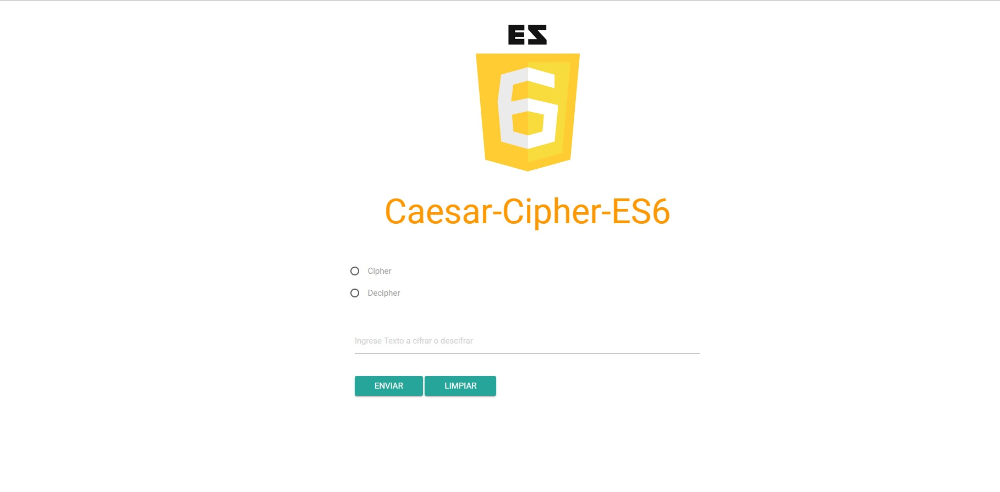

# Ejercicio
* **Track:** _JS-FRONT-END-DEVELOPER_
* **Curso:** _JS DEEP DIVE: CREA TU PROPIA LIBRERÍA USANDO JAVASCRIPT_

---

# Cifrado César ES6

>Se Debe pasar el cifrado cesar de javascript 5 a ES6 manualmente.

Se crea una web que permita, por medio de un `input`, ingresar una frase al usuario y
devuelva el mismo mensaje encriptado según el
[algoritmo de Cifrado César](https://en.wikipedia.org/wiki/Caesar_cipher)
con el parámetro de desplazamiento de **33 espacios hacia la derecha**

Por ejemplo:

- Texto original:   `hola`
- Texto codificado: `ovsh`
  
## Consideraciones específicas

* El usuario no puede ingresar un campo vacío.

## Herramientas
* Framework Materialize
* HTML5
* CSS 3
* ES6 Javascript

